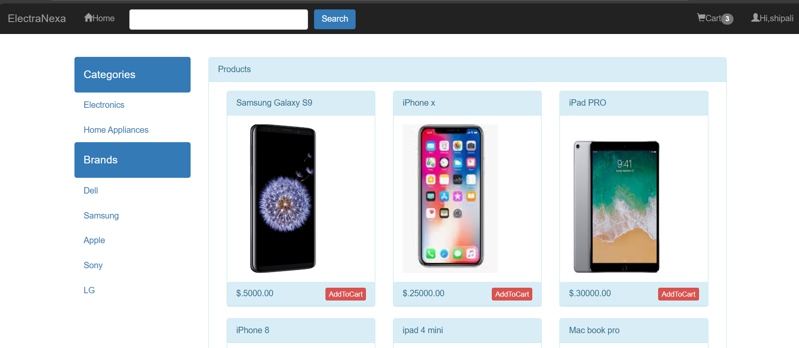
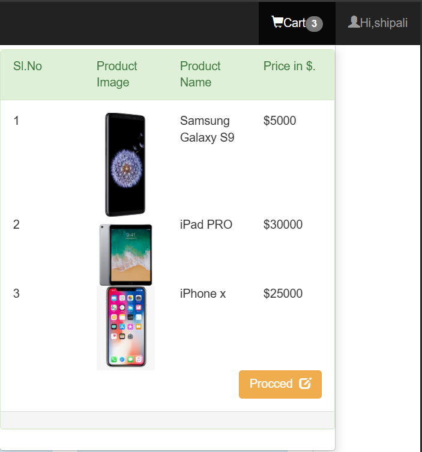
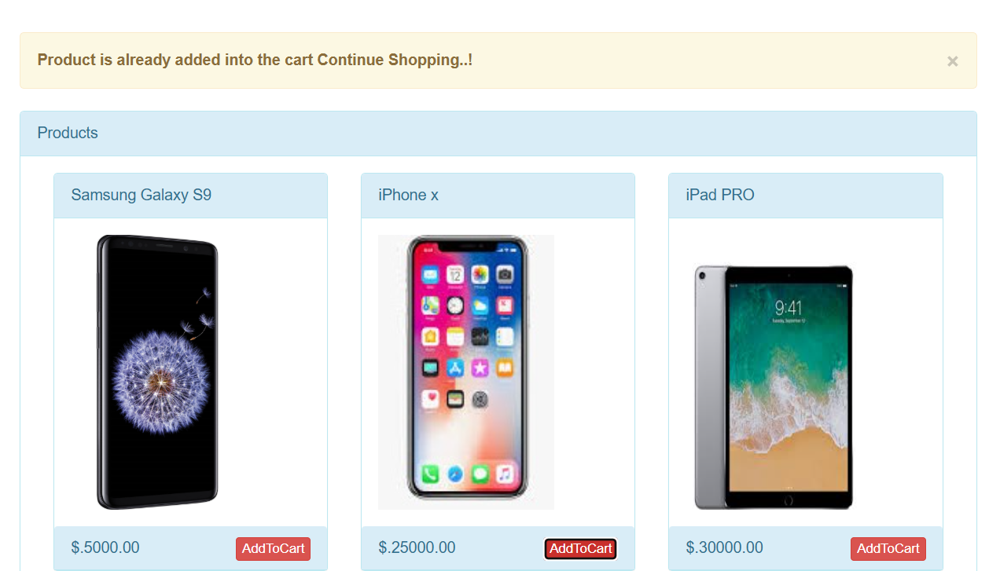
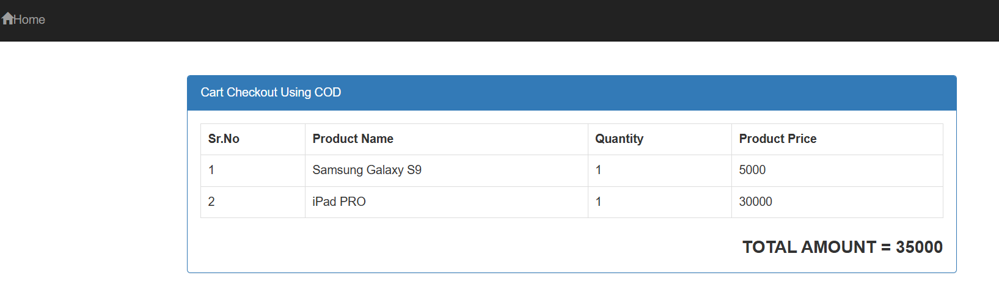

# 🛒 ElectraNexa - E-Commerce 

This is a simple PHP + MySQL based e-commerce website where users can:
- Add products to their cart
- Place an order directly
- Print an invoice 

---
## 🚀 Features
- Cart system – Add, update, remove products.
- User details – Captured from the database (user_info).
- Print option – Clean, print-friendly invoice format.

---
## 🛠️ Tech Stack
- Frontend: HTML, Bootstrap, JavaScript
- Backend: PHP 
- Database: MySQL (phpMyAdmin)

---

## 📸 Screenshots

### 🛍️ Home Page

### 🛍️ cart Page

### 🛒 Add to Cart Button

### 🧾 Final Bill

